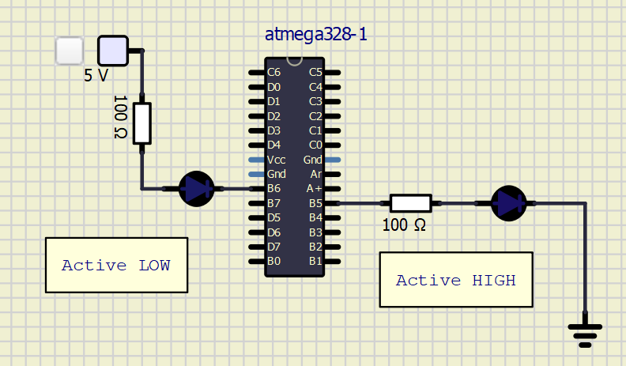
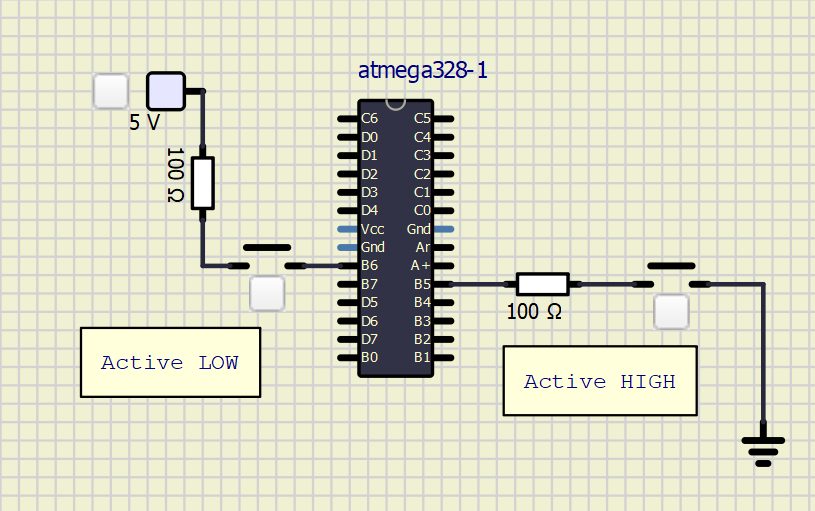

# Lab 2: Control of GPIO, LED, push button

## Preparation tasks (done before the lab at home)

1. Draw two basic ways to connect a LED to the output pin of the microcontroller: LED active-low, LED active-high.

2. [Calculate LED resistor value](https://electronicsclub.info/leds.htm) for typical red and blue LEDs.

| **LED color** | **Supply voltage** | **LED current** | **LED voltage** | **Resistor value** |
| :-: | :-: | :-: | :-: | :-: |
| red | 5&nbsp;V | 20&nbsp;mA | 2 V | 150 Ohm |
| blue | 5&nbsp;V | 20&nbsp;mA | 4 V | 50 Ohm |

3. Draw the basic ways to connect a push button to the microcontroller input pin: button active-low, button active-high.

## Part 2: Active-low and active-high LEDs

| **DDRB** | **Description** |
| :-: | :-- |
| 0 | Input pin |
| 1 | Output pin |

| **PORTB** | **Description** |
| :-: | :-- |
| 0 | Output low value |
| 1 | Output High value |

| **DDRB** | **PORTB** | **Direction** | **Internal pull-up resistor** | **Description** |
| :-: | :-: | :-: | :-: | :-- |
| 0 | 0 | Input | no | Tri-state, high-impedance |
| 0 | 1 | Input | Yes | Pxn will source current if ext. pulled low. |
| 1 | 0 | Output | no | Output Low (Sink) |
| 1 | 1 | Output | no | Output High (Source) |

| **Port** | **Pin** | **Input/output usage?** |
| :-: | :-: | :-- |
| A | x | Microcontroller ATmega328P does not contain port A |
| B | 0 | Yes (Arduino pin 8) |
|   | 1 | Yes (Arduino pin ~9) |
|   | 2 | Yes (Arduino pin ~10) |
|   | 3 | Yes (Arduino pin ~11) |
|   | 4 | Yes (Arduino pin 12) |
|   | 5 | Yes (Arduino pin 13) |
|   | 6 | No |
|   | 7 | No |
| C | 0 | Yes (Arduino pin A0) |
|   | 1 | Yes (Arduino pin A1) |
|   | 2 | Yes (Arduino pin A2) |
|   | 3 | Yes (Arduino pin A3) |
|   | 4 | Yes (Arduino pin A4) |
|   | 5 | Yes (Arduino pin A5) |
|   | 6 | No |
|   | 7 | No |
| D | 0 | Yes (Arduino pin RX<-0) |
|   | 1 | Yes (Arduino pin TX->1) |
|   | 2 | Yes (Arduino pin 2) |
|   | 3 | Yes (Arduino pin ~3) |
|   | 4 | Yes (Arduino pin 4) |
|   | 5 | Yes (Arduino pin ~5) |
|   | 6 | Yes (Arduino pin ~6) |
|   | 7 | Yes (Arduino pin 7) |
